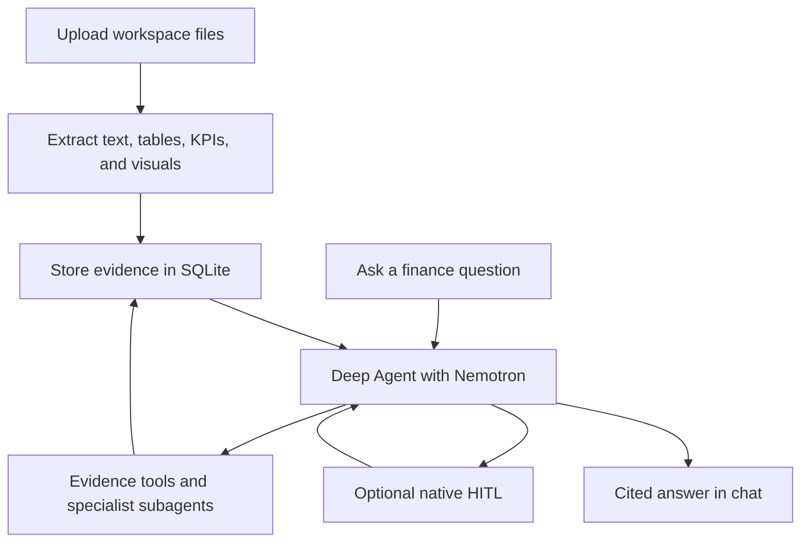

# Multimodal Financial Report Analyst

Local Astro + FastAPI prototype for analyzing annual reports, investor presentations, earnings docs, spreadsheets, screenshots, and report images. It extracts text, tables, KPIs, and rendered page images; asks Cosmos to read visual evidence; stores the results in SQLite; and answers with cited evidence through a LangChain Deep Agent.

## Stack

- Frontend: Astro server output with a React chat workbench.
- Backend: FastAPI, SQLite, local artifact storage, deterministic evidence extraction, LangChain Deep Agents.
- Reasoning model: `nvidia/Nemotron-3-Ultra-550b-a55b` through Nebius.
- Vision model: `nvidia/Cosmos3-Super-Reasoner` through Nebius.

## Setup

```bash
cd financial-report-analyst
cp .env.example backend/.env
cp .env.example frontend/.env
```

Backend:

```bash
make install-backend
make dev-backend
```

Frontend:

```bash
make install-frontend
make dev-frontend
```

Open `http://127.0.0.1:14321`.

The FastAPI backend runs on `http://127.0.0.1:18765` so it does not collide with other local apps on port `8000`. Astro proxies browser requests to the backend through `/api/*`.

## Environment

Set `NEBIUS_API_KEY` in `backend/.env`; ingestion and chat analysis require the Nebius models.

- Nemotron is used for reasoning, tool calling, KPI comparison, synthesis, and final answers.
- In uploaded workspaces, the Deep Agent graph lets Nemotron decide intent, finance scope, evidence/tool use, and subagent delegation from the prompt and workspace brief.
- Cosmos reads rendered PDF/PPT pages, screenshots, chart images, slide images, and chat-uploaded images up to `FRA_MAX_VISION_PAGES`.
- Deep Agents runs one main agent plus `kpi-analyst`, `visual-auditor`, `filing-synthesizer`, and `risk-strategy-analyst` subagents. The default general-purpose subagent is disabled.
- Deep Agent chat streams main-agent, subagent, token, review, final, and done events through `/chat/stream`.
- After uploads, the app prepares a workspace brief and suggests follow-up investigations for the user to approve or edit in chat.
- Uploaded documents may be sent to Nebius when model calls are enabled.

Without `NEBIUS_API_KEY`, uploads and chat analysis are blocked with a configuration error. This avoids confusing local-only fallback answers.

## How It Works

1. Upload files into a workspace.
2. The backend stores originals, renders pages/images, extracts deterministic text/tables/KPIs, and sends visual pages/images to Cosmos.
3. Cosmos observations, extracted evidence, KPIs, pages, and artifacts are saved in SQLite/local storage.
4. Nemotron receives compact retrieved evidence through Deep Agent tools, not full raw documents by default.
5. The Deep Agent plans with its financial tools and specialized subagents, then returns a cited analyst answer.

Chat image uploads are ingested as visual evidence first, so Cosmos reads the image and Nemotron can reason over the stored visual observation in the same question and later follow-ups.

## Flow



## Human Review

The backend includes native LangChain Deep Agents HITL with `interrupt_on` and a persistent SQLite checkpointer at `FRA_CHECKPOINT_DB_PATH`. Normal chat skips HITL and streams evidence-tool calls directly. Phrase triggers in the question — such as `human review`, `approve tools`, `approval mode`, `ask before tools`, or `controlled run` — enable interrupts on all eight read-only evidence tools so you can approve or reject each call before it runs.

## Deep Agents Features

- `create_deep_agent` powers the main financial analyst graph.
- Custom tools expose compact evidence only: corpus search, page context, table lookup, visual lookup, KPI comparison, chart-table verification, margin bridge, and document inventory.
- `context_schema` passes workspace context such as `project_id`, `thread_id`, and document filters into tools.
- `response_format` returns structured answers with `summary`, `management_stated_causes`, `arithmetic_facts`, `inference`, `citations`, `confidence`, and `needs_more_evidence`.
- Four custom subagents handle KPI analysis, visual auditing, filing synthesis, and risk/strategy analysis.
- The default `general-purpose` subagent is disabled, and default filesystem/shell tools are hidden with a harness profile.
- Streaming uses Deep Agents main-agent, subagent, token, review, final, and done events.
- Native Deep Agents HITL is implemented with `interrupt_on` and a persistent SQLite checkpointer; normal UX runs read-only analysis directly unless a phrase trigger enables review.

## Supported Files

PDF, PPTX, DOCX, XLSX, XLS, CSV, PNG, JPG, JPEG, and WEBP.

## Checks

```bash
make test
make build
```

Manual smoke flow:

1. Upload at least two reports.
2. Wait until documents show `ready`.
3. Ask starter questions such as:
   - `Build an evidence-based investment diligence framework from these files.`
   - `Which KPI changed the most, and what should I investigate next?`
   - `Compare operating margin across the uploaded reports and explain the drivers.`
   - `Does the chart agree with the figures in the matching table?`
4. Click citations and confirm they open the matching page evidence.
