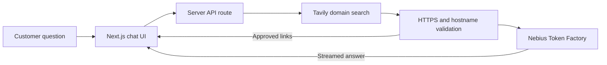

# Cool Apps and Demos built with Nebius AI

  - [WhatLLM](#whatllm)
  - [LLM Streetfighter!](#llm-streetfighter)
  - [Allycat](#allycat)
  - [Customer Support AI](#customer-support-ai)

## WhatLLM

A cool and very useful LLM comparision tool

[whatllm.org](https://www.whatllm.org/)

Built by Dylan Bristot: [demianarc](https://github.com/demianarc)  |  [demian_ai](https://twitter.com/demian_ai)

| 
|-

---

## LLM Streetfighter!

This will bring back the nostalgia of arcade games!

coming soon.

| 
|-

---

## Allycat

[Allycat](https://github.com/The-AI-Alliance/allycat) can scrape a website, index its contents and allow chatting with the website content using LLMs running on Nebius Token Factory or locally.

Author: [Sujee Maniyam](https://sujee.dev/)  |   [@sujee_dev](https://x.com/sujee_dev/)

| 
|-

---

## Customer Support AI

[Customer Support AI](https://github.com/amrrs/customer-support-ai) is an
enterprise-style Next.js demo for building a conversational support assistant
with Nebius Token Factory and Tavily. It streams Markdown responses, supports
same-session follow-up questions, and restricts retrieval to a domain selected
by the user.

The server validates every retrieved URL before its excerpt can enter model
context, and the interface hyperlinks answers only to those approved sources.
The demo can be run locally or deployed to Vercel or Render.

Built by [Amrrs](https://github.com/amrrs).

---
