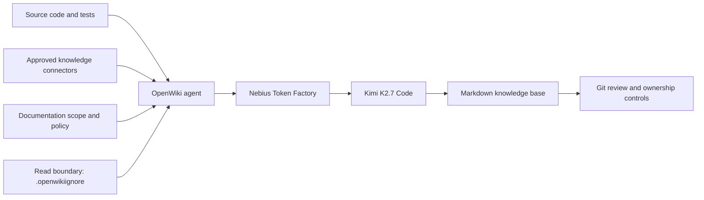

<!-- markdownlint-disable MD013 -->

# Build an enterprise knowledge base with OpenWiki and Kimi K2.7 Code

[OpenWiki](https://github.com/langchain-ai/openwiki) is a LangChain documentation agent that generates and maintains a Markdown knowledge base from source repositories or connected knowledge sources. This guide configures OpenWiki to use `moonshotai/Kimi-K2.7-Code` through the Nebius Token Factory OpenAI-compatible API.

You can use the same foundation for two related use cases:

- **Enterprise repository documentation:** architecture, APIs, domain concepts, data flows, operations, testing, and ownership are generated under a repository's `openwiki/` directory and reviewed through Git.
- **A personal or team second brain:** approved sources such as local repositories, Notion, Slack, Gmail, web search, or custom MCP servers are ingested into a local knowledge base under `~/.openwiki/wiki`.

## Architecture



OpenWiki reads the allowed evidence, asks Kimi K2.7 Code to synthesize it, and writes ordinary Markdown. For repository documentation, Git remains the publication and review boundary.

## Prerequisites

- Node.js 22 or newer
- A Nebius Token Factory account and API key
- A Git repository to document, or approved sources for personal mode

Install OpenWiki:

```bash
npm install --global openwiki
```

Keep the API key outside source control. OpenWiki's interactive setup can store credentials in `~/.openwiki/.env`, or you can export them from an approved secret manager:

```bash
export NEBIUS_API_KEY="your-token-factory-key"
export OPENWIKI_PROVIDER="nebius"
export OPENWIKI_MODEL_ID="moonshotai/Kimi-K2.7-Code"
```

Do not commit the API key to the repository, a documentation page, a notebook, or a CI workflow.

## Use case 1: enterprise repository documentation

Run OpenWiki at the root of the repository you want to document:

```bash
cd /path/to/your-repository
openwiki code --init --print
```

OpenWiki writes its knowledge base under `openwiki/`. A useful enterprise wiki should be organized around systems and change intent—not simply mirror the source tree.

### Define the documentation contract

Create `openwiki/INSTRUCTIONS.md` before the first run. OpenWiki treats this file as a user-authored brief and preserves it during normal initialization and updates.

```markdown
---
type: Documentation governance policy
title: Enterprise documentation brief
description: Scope and quality requirements for this repository's knowledge base.
tags: [documentation, governance]
---

# Documentation brief

Audience: engineers, operators, security reviewers, support, and product teams.

Document the following where supported by repository evidence:

1. System purpose, users, capabilities, boundaries, dependencies, and owners.
2. Logical and runtime architecture, deployment topology, trust boundaries,
   invariants, and major design decisions.
3. Domain terminology, business rules, entities, lifecycle, and ownership.
4. API contracts, authentication, authorization, errors, versioning, and consumers.
5. Data stores, schemas, migrations, consistency, retention, backup, and deletion.
6. Build, test, deploy, observability, incident diagnosis, rollback, and recovery.
7. Security-sensitive flows without reproducing credentials or exploit details.

Ground important claims in source, tests, schemas, deployment configuration, or
repository history. Mark unknowns explicitly. Include focused tests and the
narrowest safe validation commands for change-sensitive areas.
```

Add your organization, service tier, data classification, engineering owner, security contact, production environments, and required review policy to the brief. Do not ask the model to infer them.

### Establish a hard read boundary

OpenWiki supports a repository-root `.openwikiignore` file. Matching paths are excluded from agent reads, scans, and generated documentation.

```gitignore
# Credentials
.env
.env.*
!.env.example
**/*.pem
**/*.key
**/secrets/**
**/credentials/**

# Production, customer, and regulated exports
data/
exports/
dumps/
backups/

# Generated and vendored content
node_modules/
vendor/
dist/
build/
coverage/
openwiki/
```

Customize this boundary for your repository. Ignore rules reduce exposure during a run, but they do not remove sensitive data already present in README files, tests, or Git history.

### Review the initial knowledge base

Before merging the initial result, verify that it answers:

- What does the system do and who owns each major part?
- How does a request, event, or scheduled job flow through the system?
- Where is data stored, transformed, retained, and deleted?
- How are identities, permissions, and trust boundaries enforced?
- How is the system built, tested, deployed, observed, rolled back, and recovered?
- Which files, symbols, tests, and narrow commands are relevant to a typical change?

Generated documentation is a proposal. Service, security, and operations owners remain accountable for factual and procedural accuracy.

### Keep documentation current

After source changes, update the wiki with:

```bash
openwiki code --update --print
```

For CI, provide the key as a protected secret and configure the same provider contract:

```yaml
- name: Update OpenWiki
  run: openwiki code --update --print
  env:
    NEBIUS_API_KEY: ${{ secrets.NEBIUS_API_KEY }}
    OPENWIKI_PROVIDER: nebius
    OPENWIKI_MODEL_ID: moonshotai/Kimi-K2.7-Code
    OPENWIKI_TELEMETRY_DISABLED: "1"
```

Use a full Git checkout so OpenWiki can inspect relevant history. Have automation open a documentation pull request; do not give it autonomous merge permission. Use CODEOWNERS or an equivalent mechanism to require reviews from the responsible service, security, or operations teams.

## Use case 2: a second brain

Personal mode writes to `~/.openwiki/wiki` instead of the current repository:

```bash
openwiki personal --init
```

The onboarding flow can configure supported sources. Ingest all configured sources and update the synthesized wiki with:

```bash
openwiki ingest all --print
openwiki personal --update
```

Explore the result as an interactive graph and Markdown reader:

```bash
openwiki visualize "$HOME/.openwiki/wiki"
```

For organizational use, connector ingestion is a data-governance decision, not merely a setup step:

- use read-only, least-privilege identities;
- approve each source system and collection purpose;
- separate knowledge bases that require different access policies;
- define retention, deletion, audit, and incident procedures;
- avoid ingesting private messages, customer records, or regulated data without authorization;
- remember that a local personal wiki is not automatically a secure multi-user enterprise service.

## Enterprise operating model

| Role | Responsibility |
| --- | --- |
| Platform owner | OpenWiki version, model configuration, CI reliability, secret integration |
| Documentation owner | Information architecture, quality policy, stale-content triage |
| Service or domain owner | Accuracy of architecture, contracts, business rules, and ownership |
| Security and privacy | Read boundaries, connector approval, sensitive-data review |
| SRE or operations | Runbooks, telemetry, recovery, rollback, and SLO accuracy |

A practical rollout has four stages:

1. **Scope:** classify the repository, identify owners and audiences, and define exclusions.
2. **Baseline:** generate the wiki, resolve unsupported claims, and merge through normal review.
3. **Operate:** run updates after releases or on a schedule and publish changes through pull requests.
4. **Measure:** track page ownership, stale content, unresolved documentation debt, broken links, review acceptance, and incident findings.

For critical or regulated systems, require security and operations review, periodically reassess `.openwikiignore`, and test runbook procedures independently of documentation generation.

## Troubleshooting

### OpenWiki asks for provider setup

Confirm all three variables are available in the same shell:

```bash
test -n "$NEBIUS_API_KEY" && echo "Nebius key is set"
echo "$OPENWIKI_PROVIDER"
echo "$OPENWIKI_MODEL_ID"
```

Never print the API key itself.

### The model is rejected

Model identifiers are case-sensitive. Use:

```text
moonshotai/Kimi-K2.7-Code
```

Available models can change over time. Check the current [Nebius Token Factory model catalogue](https://tokenfactory.nebius.com/) if the identifier is unavailable to your account.

### The wiki contains unsupported claims

Tighten `openwiki/INSTRUCTIONS.md`, ensure authoritative schemas and tests are readable, and ask owners to correct the generated page. Avoid turning assumptions about topology, compliance, data classification, or ownership into documentation requirements unless those facts are evidenced.

## Security checklist

Before production adoption:

- [ ] Hosted-model processing of the repository is permitted by organizational policy and contracts.
- [ ] Nebius account access, project controls, region, retention, and logging have been reviewed.
- [ ] `NEBIUS_API_KEY` is stored in an approved secret manager and rotated appropriately.
- [ ] `.openwikiignore` covers actual credentials, customer exports, dumps, certificates, and regulated data.
- [ ] Connector credentials are read-only, least-privilege, and independently approved.
- [ ] Generated changes require accountable human reviewers and cannot merge autonomously.
- [ ] Generated security, compliance, SLO, and runbook claims are treated as unverified until owner review.
- [ ] The generated wiki is covered by normal secret scanning, DLP, retention, backup, and incident processes.

## References

- [LangChain OpenWiki](https://github.com/langchain-ai/openwiki)
- [Nebius Token Factory](https://tokenfactory.nebius.com/)
- [Nebius Token Factory documentation](https://docs.tokenfactory.nebius.com/)
