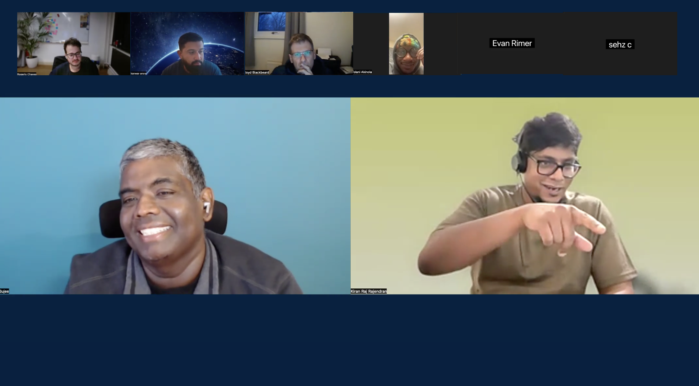

# Token Factory Office Hour #2

## Summary

- **Date**: 2026 Feb 18
- **Time**: 9am PST / 12pm EST / 6pm CET
- **Location**: Online, Live
- 📅 [Event sign up page](https://nebius.com/events/webinar-token-factory-builder-hour-agents)

## ⭐️ Resources

- 🔧 Code: [Token Factory Cookbook](https://github.com/nebius/token-factory-cookbook)
- 🔌 Integration: [Nebius proxy for Claude Code](https://github.com/KiranChilledOut/claude-codex-nebius-proxy)
- 🛠️ Partner repo: [LangWatch](https://github.com/langwatch)
- 💬 Community Chat: [Join Discord](https://discord.gg/nN58zxSTFR) → [Office Hour Channel](https://discord.com/channels/1222156136380235877/1445865431838490676)

## Agenda

1. What's new in Token Factory
2. Coding with Nebius Token Factory
3. Partner chat: [langwatch.ai](https://langwatch.ai)
4. Q&A

## Hosts / Presenters

- **Sujee Maniyam** - Developer Advocate at Nebius -   [linkedin](https://www.linkedin.com/in/sujeemaniyam/) • [x](https://x.com/sujee_dev) • [github](https://github.com/sujee) • [sujee.dev](https://sujee.dev/)
- **Kiran Raj** - Platform Engineer,  DevOps @ Nebius -   [linkedin](https://www.linkedin.com/in/kiran-raj-37b85b5b/)  • [github](https://github.com/KiranChilledOut/)

## Media

