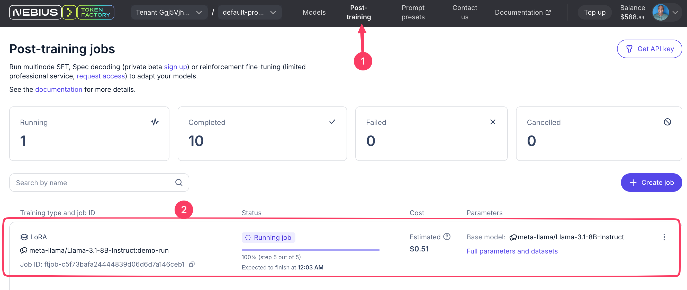
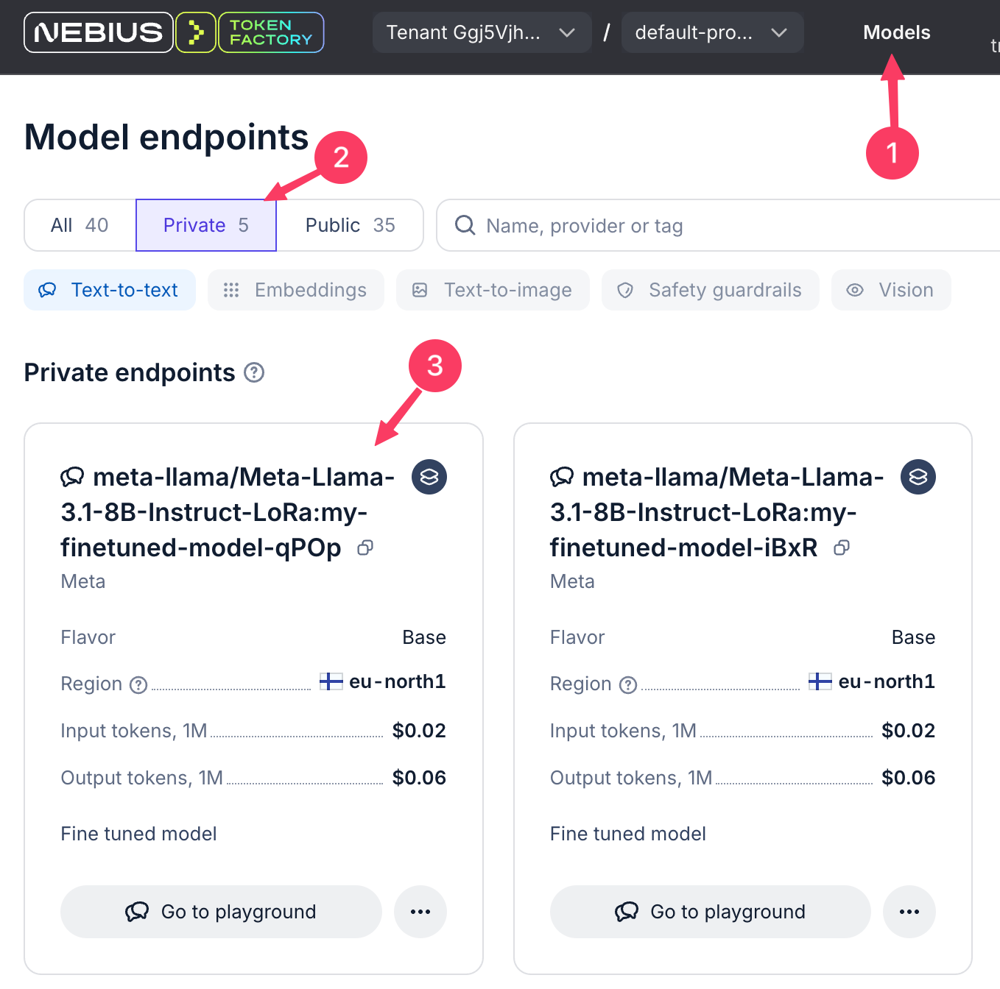

# Fine Tuning Example

In this tutorial, we demonstrate how to perform post-training / fine-tuning using **Nebius Token Factory** 


- [Fine Tuning Example](#fine-tuning-example)
  - [1. Get the code](#1-get-the-code)
  - [2. Install dependencies (If running locally)](#2-install-dependencies-if-running-locally)
  - [3 - Create .env file](#3---create-env-file)
  - [4 - Running the code](#4---running-the-code)
  - [5 - Fine tuning](#5---fine-tuning)
  - [6 - Your fine-tuned model in Nebius Token Factory](#6---your-fine-tuned-model-in-nebius-token-factory)
  - [7 - Using your fine-tuned model in Playground](#7---using-your-fine-tuned-model-in-playground)
  - [8 - Use the fine-tuned model using an API](#8---use-the-fine-tuned-model-using-an-api)
  - [References](#references)
  - [Dev Notes](#dev-notes)


## 1. Get the code

Code: [fine_tune_llama.ipynb](fine_tune_llama.ipynb)

[](https://colab.research.google.com/github/nebius/token-factory-cookbook/blob/main/post-training/fine-tuning-1/fine_tune_llama.ipynb) - run without any local setup!

```bash
git   clone    https://github.com/nebius/token-factory-cookbook/
cd    post-training/fine-tuning-1
```


## 2. Install dependencies (If running locally)

**If using `uv` (preferred)**

```bash
uv sync
uv add --dev ipykernel   # only when setting up UV for first time
uv run python -m ipykernel install --user --name="fine-tuning-1" --display-name "fine-tuning-1"
# select this kernel when running in jupyter / vscode
```

**If using Conda**

```bash
conda  create  -n fine-tuning-1  python=3.12
conda activate  fine-tuning-1
pip install -r requirements.txt
python -m ipykernel install --user --name="fine-tuning-1" --display-name "fine-tuning-1"
```

**If using `pip`**

```bash
python -m venv venv
source venv/bin/activate
pip install -r requirements.txt
python -m ipykernel install --user --name="fine-tuning-1" --display-name "fine-tuning-1"
# select this kernel when running in jupyter / vscode
```

## 3 - Create .env file

Create a `.env` file in the project root and add your Nebius API key:

```bash
cp env.example .env
```

```
NEBIUS_API_KEY=your_api_key_here
```

## 4 - Running the code

**Using VSCode**

- open the notebook: [fine_tune_llama.ipynb](fine_tune_llama.ipynb)
- run with custom jupyter kernel we created (`fine-tuning-1`)

**Using `uv`**

```bash
uv run --with jupyter jupyter lab fine_tune_llama.ipynb
```

Using standard python/pip

```bash
jupyter lab 
```

## 5 - Fine tuning

The fine tuned model will be saved into `models` directory.

Run this notebook:  [2_training.ipynb](2_training.ipynb)

You can see fine tuning jobs' status on the [post training dashboard](https://tokenfactory.nebius.com/post-training) 




## 6 - Your fine-tuned model in Nebius Token Factory

Find your fine-tuned models in **models --> private** section



## 7 - Using your fine-tuned model in Playground

Try your new shiny model in the playground!

## 8 - Use the fine-tuned model using an API

See our [API examples](../../api/README.md)

And [documentation](https://docs.tokenfactory.nebius.com//inference/quickstart)


## References

## Dev Notes

How to setup a `uv` project

```bash
uv init --python=3.12
uv add openai datasets python-dotenv  pandas  seaborn  jinja2
uv add --dev ipykernel

# create a requirements.txt file
uv export --frozen --no-hashes --no-emit-project --no-default-groups --output-file=requirements.txt

```
