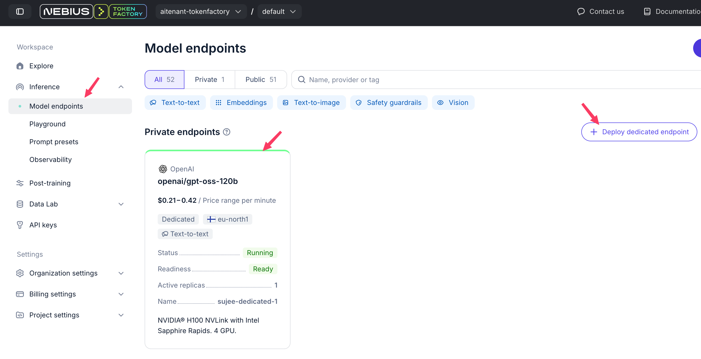
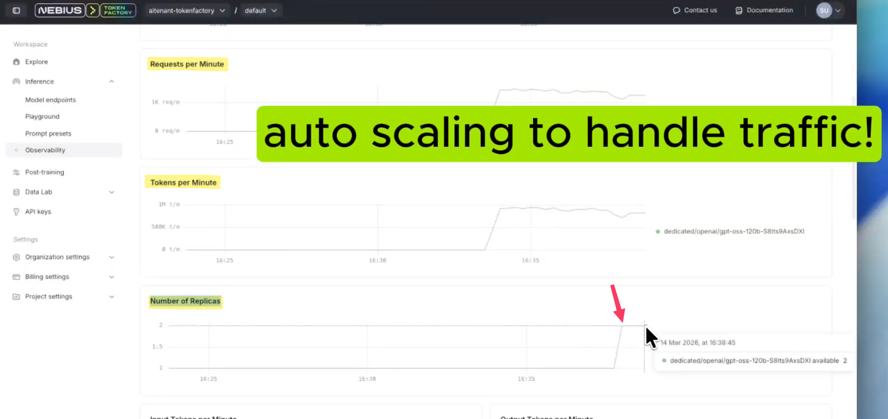

# Dedicated Endpoints

**Dedicated End Points** in Token Factory allows you:

- select a model
- specify the region to host the model
- specify the GPU pool configuration (min / mix)
- and deploy it !
- all the scaling is handled automatically!
- and real time observability built in.

[See documentation](https://docs.tokenfactory.nebius.com/ai-models-inference/dedicated-endpoints)

## Example: Deploy a dedicated end point

 

 <kbd>
 
 </kbd>

  <kbd>
 
 </kbd>